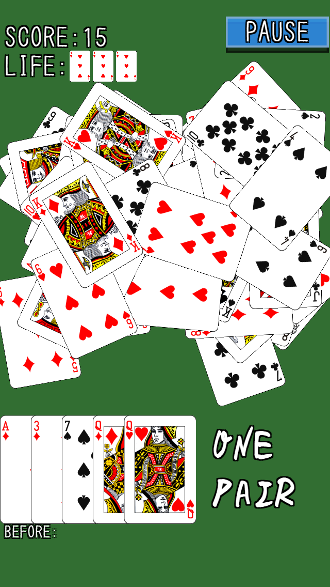
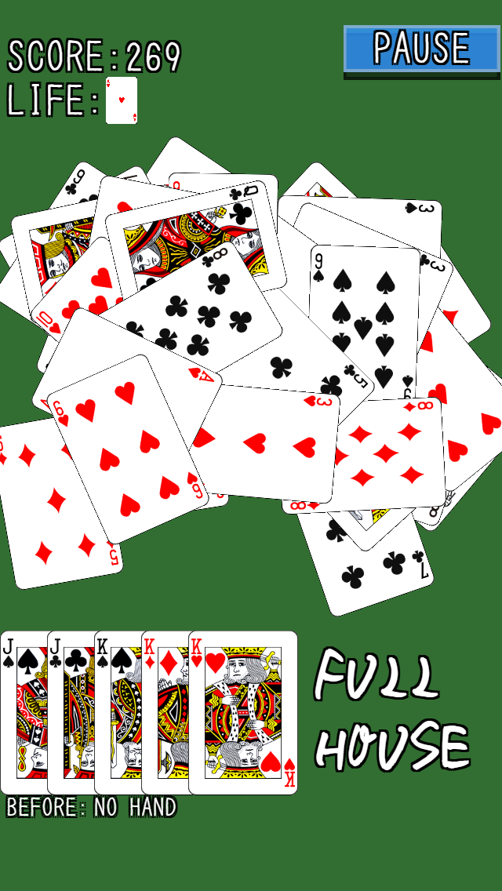
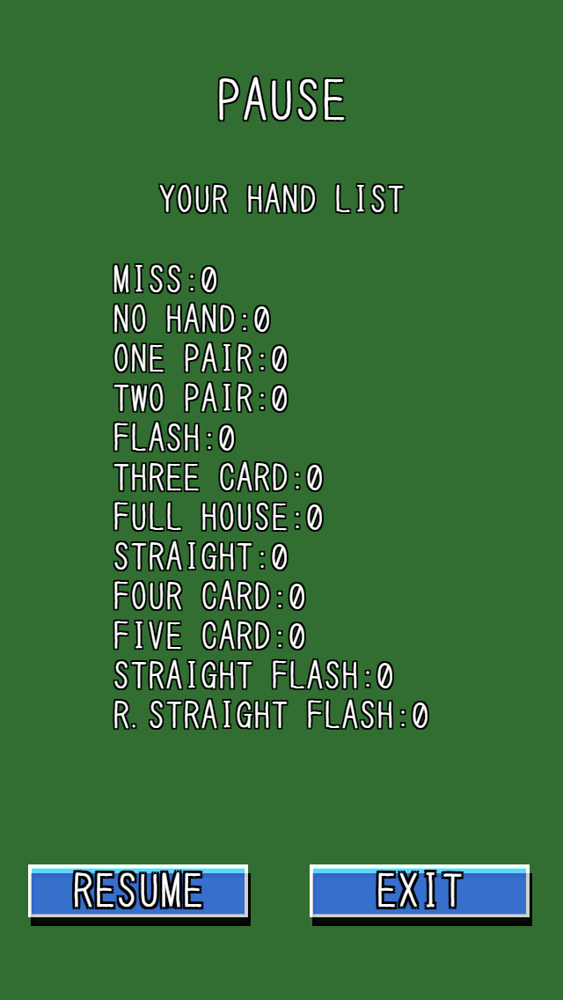

ShotgunPoker
============

『ショットガンポーカー』
制限時間以内に、場のカード５枚をタッチして選び、ポーカーの役を作ってください。
役に応じた点数がスコアに加算されます。素早く役を作ると高得点！

役無し、手札５枚未満、ワンペア連続２回でミスとなり、ライフが１つ減ります。
ロイヤルストレートフラッシュは初回のみボーナスとしてライフが１つ加算されます。
ファイブカード以外の全ての役を一回以上作るとコンプリートボーナスとしてライフ１つと２０００点が加算されます。

＜ジョーカーについて＞
ジョーカーは一回使用するとカード補充時に戻されません。
画面を左右にスワイプすると場に残っているカードのシャッフルが出来ます。

＜得点表＞
ミス：0点
役無し（ブタ）：0点
ワンペア：10点
フラッシュ：20点
ツーペア：50点
スリーカード：100点
フルハウス：200点
ストレート：300点
フォーカード：500点
ストレートフラッシュ：700点
ファイブカード：800点
ロイヤルストレートフラッシュ：1000点

